# Wiki Seeding Guide for Agentic Computational Toxicology

This is the detailed, table-of-contents indexed outline behind the high-level seeding overview. For context-efficient operation, start with [wiki-seed-overview_GPT.md](wiki-seed-overview_GPT.md) and use this file only for exact implementation details.

---

# Detailed Table-of-Contents Indexed Outline

## Table of Contents

- [D0. How to Use This Outline](#d0-how-to-use-this-outline)
- [D1. Seeding Objective and Scope](#d1-seeding-objective-and-scope)
- [D2. Seeding Priorities](#d2-seeding-priorities)
- [D3. What to Seed First](#d3-what-to-seed-first)
  - [D3.1 High-Value Concepts](#d31-high-value-concepts)
  - [D3.2 Methods and Frameworks](#d32-methods-and-frameworks)
  - [D3.3 Datasets and Assay Ecosystems](#d33-datasets-and-assay-ecosystems)
  - [D3.4 Endpoints and Biological Context](#d34-endpoints-and-biological-context)
  - [D3.5 Sentinel Chemicals](#d35-sentinel-chemicals)
  - [D3.6 Governance and Workflows](#d36-governance-and-workflows)
- [D4. What to Defer](#d4-what-to-defer)
- [D5. Page Creation and Update Rules](#d5-page-creation-and-update-rules)
  - [D5.1 Page Creation Decision Rule](#d51-page-creation-decision-rule)
  - [D5.2 Redundancy-Minimization Rule](#d52-redundancy-minimization-rule)
  - [D5.3 Index Seeding Rules](#d53-index-seeding-rules)
  - [D5.4 Cross-Linking Rules](#d54-cross-linking-rules)
  - [D5.5 Minimal Completion Standard for a Seeded Page](#d55-minimal-completion-standard-for-a-seeded-page)
  - [D5.6 Expansion Trigger Rules](#d56-expansion-trigger-rules)
- [D6. Docusaurus Structure and Logistics](#d6-docusaurus-structure-and-logistics)
  - [D6.1 Top-Level Wiki Structure](#d61-top-level-wiki-structure)
  - [D6.2 Recommended Repository Layout](#d62-recommended-repository-layout)
  - [D6.3 Category Files](#d63-category-files)
  - [D6.4 Sidebar Strategy](#d64-sidebar-strategy)
  - [D6.5 Mermaid Concept Map Support](#d65-mermaid-concept-map-support)
  - [D6.6 Build Validation](#d66-build-validation)
  - [D6.7 Compatibility Principle](#d67-compatibility-principle)
- [D7. Core Page Families and Seed Lists](#d7-core-page-families-and-seed-lists)
  - [D7.1 System Pages](#d71-system-pages)
  - [D7.2 Index Pages](#d72-index-pages)
  - [D7.3 Concept Pages](#d73-concept-pages)
  - [D7.4 Chemical Pages](#d74-chemical-pages)
  - [D7.5 Biology Pages](#d75-biology-pages)
  - [D7.6 Toxicological Endpoint Pages](#d76-toxicological-endpoint-pages)
  - [D7.7 Assay Pages](#d77-assay-pages)
  - [D7.8 Dataset Pages](#d78-dataset-pages)
  - [D7.9 Evidence Pages](#d79-evidence-pages)
  - [D7.10 Workflow Pages](#d710-workflow-pages)
  - [D7.11 Agent Operation Pages](#d711-agent-operation-pages)
  - [D7.12 Project Pages](#d712-project-pages)
  - [D7.13 Quality and Governance Pages](#d713-quality-and-governance-pages)
  - [D7.14 Glossary Pages](#d714-glossary-pages)
- [D8. Core Indices in More Detail](#d8-core-indices-in-more-detail)
- [D9. Initial Canonical Concepts](#d9-initial-canonical-concepts)
- [D10. Concept Map](#d10-concept-map)
- [D11. Initial Minimum Viable Wiki Build](#d11-initial-minimum-viable-wiki-build)
- [D12. Initial Build Checklist](#d12-initial-build-checklist)
- [D13. Final Reference File Copy Step](#d13-final-reference-file-copy-step)
- [D14. Completion Checklist](#d14-completion-checklist)

---

<a id="d0-how-to-use-this-outline"></a>
## D0. How to Use This Outline

This outline is the detailed reference behind the high-level overview. It preserves the original seeding plan while making the task easier for an autonomous agent to follow. Use section references rather than copying large blocks into task prompts whenever possible. For example, a seeding agent can be instructed to “create the D11 minimum viable pages using D5 page rules and D6 file conventions” instead of being given the whole document.

---

<a id="d1-seeding-objective-and-scope"></a>
## D1. Seeding Objective and Scope

Use this plan when planning initial wiki population. Use it to decide what knowledge to seed first, what to defer, and where early coverage should be concentrated.

Seed the wiki with enough high-value, field-specific knowledge to support retrieval, routing, early synthesis, and relevance judgment in computational toxicology. Prioritize knowledge that helps an agent interpret toxicological literature, understand method and evidence context, and decide whether newly encountered information belongs in the wiki.

Do not include strict factual knowledge that would require specific source citation unless a citation path is available. If you have a source to cite for anything you put in the wiki, include that source with a proper citation.

Do not spend early seeding capacity on generic background that a capable model already knows. Store only the parts of a topic that become meaningfully specialized in computational toxicology, regulatory toxicology, or evidence integration.

---

<a id="d2-seeding-priorities"></a>
## D2. Seeding Priorities

Seed the wiki in this order unless a project-specific need overrides it.

1. Seed cross-cutting concepts that control interpretation across the field.
2. Seed core methods and frameworks that the system will repeatedly use.
3. Seed major datasets, assay families, and evidence resources that anchor downstream work.
4. Seed a small set of sentinel chemicals and endpoints that exercise the full workflow.
5. Seed governance, quality, and workflow pages needed for reliable operation.
6. Expand breadth only after the above layers support coherent navigation and synthesis.

---

<a id="d3-what-to-seed-first"></a>
## D3. What to Seed First

<a id="d31-high-value-concepts"></a>
### D3.1 High-Value Concepts

Create concept pages for terms that repeatedly appear in toxicological literature and materially affect interpretation. Seed concepts such as hazard, risk, exposure, dose-response, benchmark dose, NOAEL and LOAEL, adverse outcome pathway, mode of action, weight of evidence, applicability domain, read-across, PBPK, IVIVE or QIVIVE, uncertainty, bioavailability, toxicokinetics, toxicodynamics, and endocrine disruption.

Write these pages to capture toxicology-specific usage, operational distinctions, and decision relevance. Emphasize scope boundaries, common confusions, and links to assays, datasets, models, endpoints, and workflows.

<a id="d32-methods-and-frameworks"></a>
### D3.2 Methods and Frameworks

Create model and method pages for the analytical machinery that structures computational toxicology. Seed pages for QSAR, read-across, PBPK modeling, IVIVE or QIVIVE, benchmark dose modeling, molecular docking as toxicology evidence, uncertainty analysis, model validation, and integrated approaches to testing and assessment where relevant.

Use these pages to state assumptions, applicability domains, inputs, outputs, validation concerns, and limits on interpretation. Prioritize methods that the system will need in order to judge evidence relevance rather than only methods that are theoretically important.

<a id="d33-datasets-and-assay-ecosystems"></a>
### D3.3 Datasets and Assay Ecosystems

Create dataset and assay pages for major public resources and common measurement systems. Seed high-reuse public resources such as ToxCast, Tox21, EPA CompTox Chemicals Dashboard, PubChem, ChEMBL, CTD, UniProt, Gene Ontology, and other open resources central to computational toxicology workflows.

Create assay pages for broad assay families and benchmark assays before adding long tails of individual protocols. Prioritize assays whose outputs commonly appear in literature or are used as evidence in hazard and mechanism assessment.

<a id="d34-endpoints-and-biological-context"></a>
### D3.4 Endpoints and Biological Context

Create endpoint pages for major toxicological outcomes that recur across the literature and regulatory discourse. Seed endpoints such as hepatotoxicity, genotoxicity, carcinogenicity, developmental toxicity, reproductive toxicity, endocrine disruption, neurotoxicity, nephrotoxicity, and immunotoxicity when relevant to the expected use cases.

Create biology pages for recurring targets, pathways, and species context that mediate interpretation. Prioritize entities such as aryl hydrocarbon receptor, estrogen receptors, androgen receptor, PPAR pathways, Nrf2 oxidative stress response, p53 pathway, liver, kidney, zebrafish embryo, mouse, and rat when they are central to the seeded chemicals, assays, and endpoints.

<a id="d35-sentinel-chemicals"></a>
### D3.5 Sentinel Chemicals

Create a small initial set of chemical pages that exercise multiple evidence types, methods, and endpoints. Choose chemicals that are well-studied, widely cited, and likely to appear in benchmark tasks. Favor substances such as Bisphenol A, PFAS representatives such as PFOA or PFOS, benzo[a]pyrene, acetaminophen, dioxin-like compounds, and a few endocrine-active or hepatotoxic examples.

Use sentinel chemicals to test cross-linking among concepts, endpoints, biology, assays, datasets, and evidence pages. Expand chemical coverage only after the wiki structure is proven on this smaller set.

<a id="d36-governance-and-workflows"></a>
### D3.6 Governance and Workflows

Seed governance pages that define evidence standards, source policy, citation rules, review thresholds, and contradiction handling. Seed workflow pages only for procedures the system will execute early and repeatedly, such as literature review, dataset profiling, claim verification, evidence-table creation, chemical page expansion, and report generation.

Do not defer these pages too long. Without them, early content will be inconsistent and difficult to audit.

---

<a id="d4-what-to-defer"></a>
## D4. What to Defer

Defer broad encyclopedia-style chemistry, biology, and statistics background unless it is specialized enough to matter in computational toxicology. Defer long lists of similar chemicals, exhaustive species pages, narrow assay variants, and low-value glossary stubs until the core conceptual and operational spine is stable.

Defer topic areas that the system is unlikely to encounter in early workflows. Expand later in response to real retrieval gaps rather than speculative completeness goals.

Do not use this document to perform source ingestion. Use the dedicated ingestion skill or ingestion workflow for extraction, summarization, source comparison, citation normalization, and evidence table creation.

---

<a id="d5-page-creation-and-update-rules"></a>
## D5. Page Creation and Update Rules

<a id="d51-page-creation-decision-rule"></a>
### D5.1 Page Creation Decision Rule

Create a new canonical page when the topic is recurring, field-specific, useful for routing or retrieval, and not already covered by an existing canonical page. Expand an existing page when the new material is a subtype, example, claim, limitation, synonym, or method detail that belongs under an existing concept or entity. Create evidence pages when the topic is a claim, confidence judgment, contradiction, evidence table, or synthesis output.

If uncertain, create a lean canonical page with a review note rather than scattering content across unrelated pages.

<a id="d52-redundancy-minimization-rule"></a>
### D5.2 Redundancy-Minimization Rule

Before seeding a page, ask what a strong model likely already knows and what it does not reliably know without a curated reference. Store the latter. Favor domain-specific definitions, toxicology-specific usage, regulator-relevant distinctions, quantitative conventions, applicability limits, evidence caveats, and structured links among entities.

Do not seed pages whose only content is generic textbook knowledge. Rewrite generic topics around computational toxicology usage, edge cases, and interpretation constraints.

<a id="d53-index-seeding-rules"></a>
### D5.3 Index Seeding Rules

Create indices early enough that agents can navigate the growing corpus without relying on search. Seed a master index and specialized indices for concepts, chemicals, endpoints, assays, datasets, models, literature, evidence pages, and workflows.

Keep indices concise and navigational. Do not let them become the primary authority for substantive scientific claims.

<a id="d54-cross-linking-rules"></a>
### D5.4 Cross-Linking Rules

During seeding, link each new canonical page to at least the most relevant neighboring pages in other core categories. Connect concepts to methods, methods to datasets and assays, assays to endpoints, endpoints to biology and chemicals, and chemicals to evidence, assays, datasets, and endpoints.

Build enough links to support multi-hop retrieval. Avoid overlinking every mention; prefer links that materially improve navigation or interpretation.

<a id="d55-minimal-completion-standard-for-a-seeded-page"></a>
### D5.5 Minimal Completion Standard for a Seeded Page

Treat a page as acceptably seeded when it has valid front matter, a clear scope, at least a short overview, a small set of high-value claims or definitions, at least one citation path, and links to the most important related pages. Leave explicit review notes where coverage is partial.

Do not wait for completeness before creating a useful canonical page. Seed the page once it can support retrieval and future accumulation.

<a id="d56-expansion-trigger-rules"></a>
### D5.6 Expansion Trigger Rules

Expand a seeded topic when one of the following becomes true: the page appears often in retrieval paths, new sources repeatedly point to the same concept or entity, contradictions accumulate and require structured evidence handling, a workflow depends on the topic as a recurring decision point, or a project needs the page as a stable reference.

If none of these conditions apply, keep the page lean and avoid speculative elaboration.

---

<a id="d6-docusaurus-structure-and-logistics"></a>
## D6. Docusaurus Structure and Logistics

<a id="d61-top-level-wiki-structure"></a>
### D6.1 Top-Level Wiki Structure

When seeding the wiki, ensure this structure is adhered to and that all referenced subfolders and pages are created according to this document.

```text
./wiki/docs
  /00-system
  /01-indices
  /02-concepts
  /03-chemicals
  /04-biology
  /05-toxicological-endpoints
  /06-assays
  /07-datasets
  /08-models-and-methods
  /09-literature
  /10-evidence
  /11-workflows
  /12-agent-operations
  /13-projects
  /14-quality-and-governance
  /15-glossary
```

Use `10-evidence` as the canonical folder name. If legacy instructions refer to `10_evidence`, normalize them to `10-evidence`.

<a id="d62-recommended-repository-layout"></a>
### D6.2 Recommended Repository Layout

The conceptual wiki structure should be implemented with a Docusaurus-compatible filesystem layer. Use Markdown or MDX files under the Docusaurus `docs/` directory, filesystem-safe filenames, front matter, category metadata, relative links, and Mermaid configuration.

```text
./wiki/
  docusaurus.config.ts
  sidebars.ts
  package.json
  docs/
    intro.md
    00-system/
      _category_.json
      wiki-mission-and-scope.md
      computational-toxicology-system-overview.md
      agent-roles-and-capabilities.md
    01-indices/
      _category_.json
      master-index.md
      chemical-index.md
      toxicological-endpoint-index.md
      assay-index.md
      dataset-index.md
      model-index.md
      literature-index.md
      evidence-claim-index.md
      agent-workflow-index.md
    02-concepts/
      _category_.json
      hazard.md
      risk.md
      exposure.md
      qsar.md
      applicability-domain.md
      weight-of-evidence.md
      adverse-outcome-pathway.md
    03-chemicals/
      _category_.json
    04-biology/
      _category_.json
      targets/
        _category_.json
      pathways/
        _category_.json
      species/
        _category_.json
    05-toxicological-endpoints/
      _category_.json
    06-assays/
      _category_.json
    07-datasets/
      _category_.json
      chembl.md
      comptox-chemicals-dashboard.md
      pubchem.md
      tox21.md
      toxcast.md
      pubmed.md
    08-models-and-methods/
      _category_.json
      qsar-models.md
      read-across.md
      pbpk-modeling.md
      qivive.md
    09-literature/
      _category_.json
      papers/
        _category_.json
      reviews/
        _category_.json
      regulatory-reports/
        _category_.json
    10-evidence/
      _category_.json
      evidence-table-template.md
      contradiction-register.md
    11-workflows/
      _category_.json
      literature-review-workflow.md
      chemical-hazard-assessment-workflow.md
      dataset-profiling-workflow.md
      in-silico-assay-workflow.md
    12-agent-operations/
      _category_.json
      agent-task-template.md
      tool-invocation-record.md
      model-execution-record.md
      audit-log.md
    13-projects/
      _category_.json
      active-project-index.md
    14-quality-and-governance/
      _category_.json
      evidence-standards.md
      citation-and-provenance-rules.md
      human-review-checkpoints.md
      responsible-use-policy.md
    15-glossary/
      _category_.json
      glossary.md
```

<a id="d63-category-files"></a>
### D6.3 Category Files

Each folder should include a `_category_.json` file so Docusaurus can display clean sidebar categories.

Example:

```json
{
  "label": "Chemicals",
  "position": 3,
  "link": {
    "type": "generated-index",
    "description": "Chemical entity pages, including substances, mixtures, metabolites, and chemical classes."
  }
}
```

Top-level category ordering:

| Position | Folder | Label |
|---:|---|---|
| 0 | `00-system` | System |
| 1 | `01-indices` | Indices |
| 2 | `02-concepts` | Concepts |
| 3 | `03-chemicals` | Chemicals |
| 4 | `04-biology` | Biology |
| 5 | `05-toxicological-endpoints` | Toxicological Endpoints |
| 6 | `06-assays` | Assays |
| 7 | `07-datasets` | Datasets |
| 8 | `08-models-and-methods` | Models and Methods |
| 9 | `09-literature` | Literature |
| 10 | `10-evidence` | Evidence |
| 11 | `11-workflows` | Workflows |
| 12 | `12-agent-operations` | Agent Operations |
| 13 | `13-projects` | Projects |
| 14 | `14-quality-and-governance` | Quality and Governance |
| 15 | `15-glossary` | Glossary |

<a id="d64-sidebar-strategy"></a>
### D6.4 Sidebar Strategy

For the initial wiki, use Docusaurus autogenerated sidebars and curate only the most important landing pages manually.

Example `sidebars.ts`:

```ts
import type {SidebarsConfig} from '@docusaurus/plugin-content-docs';

const sidebars: SidebarsConfig = {
  wikiSidebar: [
    'intro',
    {
      type: 'autogenerated',
      dirName: '.',
    },
  ],
};

export default sidebars;
```

As the wiki matures, curated sidebars can be added for chemicals, endpoints, assays, workflows, and evidence claims.

<a id="d65-mermaid-concept-map-support"></a>
### D6.5 Mermaid Concept Map Support

The concept map uses Mermaid. To render it in Docusaurus, enable Mermaid in `docusaurus.config.ts`.

```ts
import type {Config} from '@docusaurus/types';
import {themes as prismThemes} from 'prism-react-renderer';

const config: Config = {
  markdown: {
    mermaid: true,
  },
  themes: ['@docusaurus/theme-mermaid'],
  themeConfig: {
    prism: {
      theme: prismThemes.github,
      darkTheme: prismThemes.dracula,
    },
  },
};

export default config;
```

<a id="d66-build-validation"></a>
### D6.6 Build Validation

Before using the wiki as an operational knowledge substrate, validate the site locally.

```bash
npm install
npm run start
npm run build
```

The build should fail on broken links if `onBrokenLinks: 'throw'` is configured. Broken links indicate retrieval and provenance problems for both humans and agents.

<a id="d67-compatibility-principle"></a>
### D6.7 Compatibility Principle

The Docusaurus layer should not replace the knowledge model. It is an implementation wrapper around the same atomic, linked, evidence-centered wiki. Pages should remain agent-operable through structured front matter and consistent sections, while Docusaurus provides navigation, rendering, search, and publishing.

---

<a id="d7-core-page-families-and-seed-lists"></a>
## D7. Core Page Families and Seed Lists

Create all required top-level categories and the recommended pages needed for the first build. If a subfolder is specified with no pages in it, create the `_category_.json` file. Make sure all pages follow the template associated with their `page_type`.

<a id="d71-system-pages"></a>
### D7.1 System Pages

Location: `/00-system`

These pages define the purpose, operating assumptions, agent boundaries, and knowledge management rules.

Recommended pages are `Wiki Mission and Scope`, `Computational Toxicology System Overview`, `Agent Roles and Capabilities`, `Knowledge Representation Principles`, `Evidence Standards`, `Citation and Provenance Rules`, `Uncertainty Representation`, `Update and Review Policy`, `Ontology Alignment Policy`, `Human-in-the-Loop Escalation Rules`, `Safety, Biosecurity, and Responsible Use Policy`, and `Known Limitations of the Wiki`.

<a id="d72-index-pages"></a>
### D7.2 Index Pages

Location: `/01-indices`

Index pages are curated navigation and retrieval surfaces optimized for humans and agents. Recommended indices are `Master Index`, `Chemical Index`, `Toxicological Endpoint Index`, `Assay Index`, `Dataset Index`, `Model Index`, `Method Index`, `Literature Index`, `Regulatory Source Index`, `Biological Target Index`, `Pathway Index`, `Adverse Outcome Pathway Index`, `Mechanism of Action Index`, `Exposure Scenario Index`, `Evidence Claim Index`, `Benchmark Compound Index`, `Uncertainty and Gap Index`, `Active Project Index`, `Agent Workflow Index`, and `Tool and API Index`.

Each index should include front matter fields such as:

```yaml
page_type: index
entity_class: chemical | assay | endpoint | dataset | model | source | pathway | workflow
curator: human_or_agent_name
last_reviewed: YYYY-MM-DD
status: draft | active | deprecated
```

<a id="d73-concept-pages"></a>
### D7.3 Concept Pages

Location: `/02-concepts`

Concept pages define the vocabulary and reasoning substrate of the system. They should be short, precise, heavily linked, and reusable across tasks.

General toxicology concepts include `Hazard`, `Risk`, `Exposure`, `Dose`, `Dose-Response Relationship`, `Threshold Effect`, `No Observed Adverse Effect Level`, `Lowest Observed Adverse Effect Level`, `Benchmark Dose`, `Margin of Exposure`, `Toxicokinetics`, `Toxicodynamics`, `Bioavailability`, `Metabolism`, `Bioaccumulation`, `Persistence`, `Susceptible Population`, `Route of Exposure`, `Acute Toxicity`, `Chronic Toxicity`, `Subchronic Toxicity`, `Mixture Toxicity`, `Read-Across`, and `Weight of Evidence`.

Computational toxicology concepts include `In Silico Toxicology`, `QSAR`, `QSPR`, `Molecular Descriptor`, `Chemical Fingerprint`, `Applicability Domain`, `Model Calibration`, `Model Validation`, `External Validation`, `Cross Validation`, `Data Leakage`, `Class Imbalance`, `ToxCast`, `Tox21`, `High-Throughput Screening`, `High-Content Screening`, `Virtual Screening`, `Molecular Docking`, `Molecular Dynamics`, `Physiologically Based Pharmacokinetic Modeling`, `Quantitative In Vitro to In Vivo Extrapolation`, `Adverse Outcome Pathway`, `Key Event`, `Key Event Relationship`, `Mechanism of Action`, and `Mode of Action`.

Evidence and review concepts include `Primary Study`, `Review Article`, `Systematic Review`, `Evidence Extraction`, `Evidence Table`, `Study Quality Assessment`, `Risk of Bias`, `Confounding`, `Reproducibility`, `Replicability`, `Causal Inference`, `Concordance`, `Contradictory Evidence`, `Uncertainty Factor`, `Confidence Rating`, `Evidence Gap`, and `Data Provenance`.

Agentic system concepts include `Agent Task`, `Agent Plan`, `Agent Memory`, `Retrieval-Augmented Generation`, `Tool Invocation`, `Autonomous Analysis`, `Human Review Checkpoint`, `Claim Verification`, `Citation Grounding`, `Dataset Profiling`, `Model Execution Record`, `Assay Execution Record`, `Knowledge Graph Update`, `Error Log`, and `Audit Trail`.

<a id="d74-chemical-pages"></a>
### D7.4 Chemical Pages

Location: `/03-chemicals`

Chemical pages represent substances, mixtures, metabolites, and chemical classes. Example pages are `Bisphenol A`, `Benzo[a]pyrene`, `Acetaminophen`, `Perfluorooctanoic Acid`, `Glyphosate`, `Aflatoxin B1`, `Phthalates`, `Polycyclic Aromatic Hydrocarbons`, and `PFAS`.

<a id="d75-biology-pages"></a>
### D7.5 Biology Pages

Location: `/04-biology`

Biology pages describe biological entities relevant to toxicity mechanisms. Use subfolders for `targets`, `genes`, `proteins`, `pathways`, `cell_types`, `organs`, and `species`. Prefer kebab-case folder names in implementation, such as `cell-types`.

Example pages are `Aryl Hydrocarbon Receptor`, `Estrogen Receptor Alpha`, `Pregnane X Receptor`, `NRF2 Oxidative Stress Response`, `p53 Pathway`, `Mitochondrial Dysfunction`, `Hepatocyte`, `Zebrafish Embryo`, `Human Liver`, `Rat`, and `Mouse`.

<a id="d76-toxicological-endpoint-pages"></a>
### D7.6 Toxicological Endpoint Pages

Location: `/05-toxicological-endpoints`

Endpoint pages define adverse outcomes or measurable toxicity categories. Initial endpoint pages are `Carcinogenicity`, `Mutagenicity`, `Genotoxicity`, `Developmental Toxicity`, `Reproductive Toxicity`, `Endocrine Disruption`, `Hepatotoxicity`, `Nephrotoxicity`, `Neurotoxicity`, `Cardiotoxicity`, `Immunotoxicity`, `Respiratory Toxicity`, `Skin Sensitization`, `Eye Irritation`, `Acute Oral Toxicity`, `Acute Dermal Toxicity`, `Acute Inhalation Toxicity`, `Mitochondrial Toxicity`, `Oxidative Stress`, `DNA Damage`, `Cholestasis`, and `Steatosis`.

<a id="d77-assay-pages"></a>
### D7.7 Assay Pages

Location: `/06-assays`

Assay pages include experimental assays, high-throughput screens, in vitro methods, and in silico assay-like procedures. Initial assay pages are `Ames Test`, `Micronucleus Assay`, `Comet Assay`, `hERG Inhibition Assay`, `Estrogen Receptor Transactivation Assay`, `Androgen Receptor Binding Assay`, `AhR Activation Assay`, `NRF2 Reporter Assay`, `Mitochondrial Membrane Potential Assay`, `CYP450 Inhibition Assay`, `Tox21 Assays`, `ToxCast Assays`, `Zebrafish Developmental Toxicity Assay`, `Molecular Docking`, `QSAR Prediction`, and `Read-Across Assessment`.

<a id="d78-dataset-pages"></a>
### D7.8 Dataset Pages

Location: `/07-datasets`

Dataset pages represent structured data sources, assay collections, benchmark sets, and derived data products. Initial dataset pages are `ToxCast`, `Tox21`, `CompTox Chemicals Dashboard`, `PubChem BioAssay`, `ChEMBL Toxicity-Related Assays`, `Comparative Toxicogenomics Database`, `DrugMatrix`, `Open TG-GATEs`, `EPA DSSTox`, `Benchmark Dose Dataset`, and `QSAR Ready Dataset`.

<a id="d79-evidence-pages"></a>
### D7.9 Evidence Pages

Location: `/10-evidence`

Evidence pages are central to the wiki. They represent claims, evidence tables, contradiction sets, confidence assessments, and synthesis outputs. Recommended pages are `Evidence Claim Index`, `Evidence Table Template`, `Claim BPA Activates Estrogen Receptor Alpha In Vitro`, `Claim Benzo[a]pyrene Is Genotoxic Through Metabolic Activation`, `Claim Acetaminophen Causes Dose-Dependent Hepatotoxicity`, `Contradiction Register`, `Evidence Gap Register`, `Confidence Rating Rubric`, and `Weight of Evidence Framework`.

<a id="d710-workflow-pages"></a>
### D7.10 Workflow Pages

Location: `/11-workflows`

Workflow pages define repeatable agent procedures. Initial workflow pages are `Literature Review Workflow`, `Systematic Evidence Extraction Workflow`, `Chemical Hazard Assessment Workflow`, `Dataset Profiling Workflow`, `QSAR Prediction Workflow`, `Molecular Docking Workflow`, `PBPK Modeling Workflow`, `QIVIVE Workflow`, `Read-Across Workflow`, `Contradictory Evidence Resolution Workflow`, `Knowledge Graph Update Workflow`, and `Human Review Escalation Workflow`.

<a id="d711-agent-operation-pages"></a>
### D7.11 Agent Operation Pages

Location: `/12-agent-operations`

These pages support autonomy, traceability, debugging, and governance. Recommended pages are `Agent Role Researcher`, `Agent Role Data Analyst`, `Agent Role Model Executor`, `Agent Role Evidence Synthesizer`, `Agent Role Curator`, `Agent Task Template`, `Agent Plan Template`, `Tool Invocation Record`, `Assay Execution Record`, `Model Execution Record`, `Dataset Profiling Record`, `Error Log`, `Audit Trail`, `Human Review Queue`, and `Prompt and Policy Register`.

<a id="d712-project-pages"></a>
### D7.12 Project Pages

Location: `/13-projects`

Project pages organize work around specific assessment questions. Example project pages are `Project BPA Endocrine Disruption Assessment`, `Project PFAS Hepatotoxicity Evidence Map`, `Project Tox21 QSAR Benchmarking`, `Project Read-Across for Phthalate Alternatives`, and `Project Literature Review of Mitochondrial Toxicity Assays`.

<a id="d713-quality-and-governance-pages"></a>
### D7.13 Quality and Governance Pages

Location: `/14-quality-and-governance`

Recommended pages are `Evidence Standards`, `Citation and Provenance Rules`, `Study Quality Assessment Rubric`, `Risk of Bias Rubric`, `Model Validation Standard`, `Dataset Quality Standard`, `Uncertainty Representation Standard`, `Human Review Checkpoints`, `Responsible Use Policy`, `Biosecurity and Dual Use Considerations`, `Regulatory Interpretation Disclaimer`, `Versioning and Audit Policy`, and `Deprecation Policy`.

<a id="d714-glossary-pages"></a>
### D7.14 Glossary Pages

Location: `/15-glossary`

Recommended pages are `Glossary`, `Acronyms`, `Identifier Systems`, and `Ontology Crosswalks`.

---

<a id="d8-core-indices-in-more-detail"></a>
## D8. Core Indices in More Detail

The master index is the single navigation surface for all major entity classes. It should include sections for system and governance, concepts, chemicals, biological targets and pathways, toxicological endpoints, assays, datasets, models and methods, literature, evidence claims, workflows, projects, and agent operations.

The chemical index should track fields such as chemical name, CASRN, DSSTox ID, PubChem CID, class, key endpoints, evidence confidence, and status. For example, Bisphenol A may be listed as a phenol with endocrine-disruption relevance, and benzo[a]pyrene may be listed as a PAH with genotoxicity and carcinogenicity relevance.

The toxicological endpoint index should track endpoint, category, regulatory relevance, key assays, key mechanisms, and evidence standards. For example, genotoxicity should point to Ames, micronucleus, and comet assays, while hepatotoxicity may point to ALT/AST, transcriptomics, histopathology, oxidative stress, and mitochondrial dysfunction.

The assay index should track assay name, type, endpoint, target or system, output, and limitations. For example, the Ames Test should capture its mutagenicity purpose and metabolic activation dependence, while Molecular Docking should capture binding-potential outputs and scoring uncertainty.

The dataset index should track dataset owner, data type, chemical coverage, endpoint coverage, access, and quality notes. ToxCast and Tox21 should be treated as high-priority public HTS resources with assay-specific caveats.

The evidence claim index should track claim ID, claim, subject, relationship, object, confidence, and review status. The workflow index should track workflow, inputs, outputs, tools, and human review triggers.

---

<a id="d9-initial-canonical-concepts"></a>
## D9. Initial Canonical Concepts

These are the first concept pages to create because they support reasoning across almost every autonomous task.

1. `Hazard`
2. `Risk`
3. `Exposure`
4. `Dose-Response Relationship`
5. `Weight of Evidence`
6. `Adverse Outcome Pathway`
7. `Applicability Domain`
8. `Uncertainty`
9. `Evidence Claim`
10. `Citation Grounding`
11. `Human Review Checkpoint`
12. `Model Validation`
13. `Dataset Profiling`
14. `QSAR`
15. `Read-Across`
16. `QIVIVE`
17. `PBPK Modeling`
18. `Mechanism of Action`
19. `Bioactivity`
20. `Toxicological Endpoint`

---

<a id="d10-concept-map"></a>
## D10. Concept Map

```mermaid
graph TD

  A[Agentic Computational Toxicology System]

  A --> B[LLM Research Wiki]
  A --> C[Autonomous Workflows]
  A --> D[Computational Toxicology Knowledge Base]
  A --> E[Governance and Safety Layer]

  B --> B1[Atomic Pages]
  B --> B2[Indices]
  B --> B3[Concept Pages]
  B --> B4[Entity Pages]
  B --> B5[Evidence Pages]
  B --> B6[Operation Logs]

  B2 --> B2a[Chemical Index]
  B2 --> B2b[Endpoint Index]
  B2 --> B2c[Assay Index]
  B2 --> B2d[Dataset Index]
  B2 --> B2e[Model Index]
  B2 --> B2f[Evidence Claim Index]
  B2 --> B2g[Workflow Index]

  B3 --> C1[Hazard]
  B3 --> C2[Risk]
  B3 --> C3[Exposure]
  B3 --> C4[Dose-Response]
  B3 --> C5[Weight of Evidence]
  B3 --> C6[Applicability Domain]
  B3 --> C7[Adverse Outcome Pathway]
  B3 --> C8[Uncertainty]

  B4 --> D1[Chemicals]
  B4 --> D2[Biological Targets]
  B4 --> D3[Pathways]
  B4 --> D4[Toxicological Endpoints]
  B4 --> D5[Assays]
  B4 --> D6[Datasets]
  B4 --> D7[Models and Methods]
  B4 --> D8[Literature Sources]

  D1 --> X1[Identifiers]
  D1 --> X2[Structures]
  D1 --> X3[Exposure Contexts]
  D1 --> X4[Metabolites]
  D1 --> X5[Known Endpoints]

  D4 --> Y1[Carcinogenicity]
  D4 --> Y2[Genotoxicity]
  D4 --> Y3[Hepatotoxicity]
  D4 --> Y4[Endocrine Disruption]
  D4 --> Y5[Developmental Toxicity]
  D4 --> Y6[Neurotoxicity]

  D5 --> Z1[In Vitro Assays]
  D5 --> Z2[In Vivo Assays]
  D5 --> Z3[In Silico Assays]
  D5 --> Z4[High-Throughput Screens]

  C --> W1[Literature Review]
  C --> W2[Dataset Profiling]
  C --> W3[QSAR Prediction]
  C --> W4[Molecular Docking]
  C --> W5[PBPK Modeling]
  C --> W6[Evidence Synthesis]
  C --> W7[Knowledge Graph Update]

  W1 --> EV1[Extracted Claims]
  W2 --> EV2[Dataset Quality Notes]
  W3 --> EV3[Model Predictions]
  W4 --> EV4[Binding Hypotheses]
  W5 --> EV5[Exposure-to-Dose Estimates]
  W6 --> EV6[Confidence Ratings]

  B5 --> EV1
  B5 --> EV3
  B5 --> EV6
  B5 --> EV7[Contradictions]
  B5 --> EV8[Evidence Gaps]

  E --> G1[Citation Provenance]
  E --> G2[Human Review Checkpoints]
  E --> G3[Audit Trail]
  E --> G4[Responsible Use Rules]
  E --> G5[Uncertainty Policy]

  G2 --> W6
  G3 --> B6
```



---

<a id="d11-initial-minimum-viable-wiki-build"></a>
## D11. Initial Minimum Viable Wiki Build

For a practical first build, create the following pages first.

System and governance pages are `Wiki Mission and Scope`, `Computational Toxicology System Overview`, `Agent Roles and Capabilities`, `Evidence Standards`, `Citation and Provenance Rules`, `Human Review Checkpoints`, `Responsible Use Policy`, and `Uncertainty Representation`.

Index pages are `Master Index`, `Chemical Index`, `Endpoint Index`, `Assay Index`, `Dataset Index`, `Model Index`, `Evidence Claim Index`, and `Workflow Index`.

Concept pages are `Hazard`, `Risk`, `Exposure`, `Dose-Response Relationship`, `Weight of Evidence`, `Adverse Outcome Pathway`, `Applicability Domain`, `Uncertainty`, `Evidence Claim`, `Citation Grounding`, `Human Review Checkpoint`, `Model Validation`, `Dataset Profiling`, `QSAR`, `Read-Across`, `QIVIVE`, `PBPK Modeling`, `Mechanism of Action`, `Bioactivity`, and `Toxicological Endpoint`.

Chemical pages are `Bisphenol A`, `Benzo[a]pyrene`, `Acetaminophen`, `Perfluorooctanoic Acid`, `Glyphosate`, `Aflatoxin B1`, `Diethylhexyl Phthalate`, `Cadmium`, `Arsenic`, and `Triclosan`.

Endpoint pages are `Genotoxicity`, `Carcinogenicity`, `Hepatotoxicity`, `Endocrine Disruption`, `Developmental Toxicity`, `Reproductive Toxicity`, `Neurotoxicity`, `Cardiotoxicity`, `Mitochondrial Toxicity`, and `Skin Sensitization`.

Assay pages are `Ames Test`, `Micronucleus Assay`, `Comet Assay`, `Estrogen Receptor Transactivation Assay`, `AhR Activation Assay`, `NRF2 Reporter Assay`, `Mitochondrial Membrane Potential Assay`, `hERG Inhibition Assay`, `Molecular Docking`, and `QSAR Prediction`.

Dataset pages are `ToxCast`, `Tox21`, `CompTox Chemicals Dashboard`, `PubChem BioAssay`, and `Comparative Toxicogenomics Database`.

Workflow pages are `Literature Review Workflow`, `Evidence Extraction Workflow`, `Chemical Hazard Assessment Workflow`, `Dataset Profiling Workflow`, `QSAR Prediction Workflow`, `Molecular Docking Workflow`, `Evidence Synthesis Workflow`, `Knowledge Graph Update Workflow`, `Contradiction Resolution Workflow`, and `Human Review Escalation Workflow`.

---

<a id="d12-initial-build-checklist"></a>
## D12. Initial Build Checklist

```text
[ ] Create repository and folder structure
[ ] Create page templates
[ ] Create metadata schema
[ ] Create master index
[ ] Create seed concept pages
[ ] Create seed chemical pages
[ ] Create seed endpoint pages
[ ] Create seed assay pages
[ ] Create seed dataset pages
[ ] Create seed model/method pages
[ ] Create literature source template
[ ] Create workflow templates
[ ] Create agent role pages
[ ] Create audit log schema
[ ] Create human review policy
[ ] Test retrieval with 5 representative tasks
[ ] Place pages under the Docusaurus docs/ directory or configure a custom docs path
[ ] Convert folder names and filenames to lowercase kebab-case
[ ] Add Docusaurus-compatible YAML front matter to every page
[ ] Add _category_.json files to all major folders
[ ] Configure sidebars.ts for autogenerated or curated navigation
[ ] Enable Mermaid support for concept maps
[ ] Validate relative links with npm run build
[ ] Test page update behavior
[ ] Test contradictory evidence handling
[ ] Test rollback/versioning
```

---

<a id="d13-final-reference-file-copy-step"></a>
## D13. Final Reference File Copy Step

Once the checklist has been fully checked off, copy the following reference files into the wiki.

- `./reference/page-templates-examples.md` → `../../wiki/docs/00-system/page-templates-examples.md`
- `./reference/spec.md` → `../../wiki/docs/00-system/spec.md`
- `./reference/top-level-categories.md` → `../../wiki/docs/00-system/top-level-categories.md`

---

<a id="d14-completion-checklist"></a>
## D14. Completion Checklist

Use this checklist to determine whether initial wiki seeding is complete enough to support retrieval, routing, early synthesis, and verification. Mark an item complete only when the condition is satisfied in the wiki itself, not merely planned.

<a id="d141-core-structural-coverage"></a>
### D14.1 Core Structural Coverage

- [ ] The wiki contains the required top-level categories and index pages needed for navigation.
- [ ] The wiki contains a master index that links to all major seeded categories.
- [ ] Each seeded top-level category has at least one navigable index or generated entry point.
- [ ] Seeded pages use valid front matter, stable IDs, stable slugs, and an approved `page_type`.
- [ ] Seeded pages are placed in the correct top-level category according to canonical purpose.

<a id="d142-minimum-domain-spine"></a>
### D14.2 Minimum Domain Spine

- [ ] High-value concept pages exist for the core interpretive terms the agent will repeatedly encounter.
- [ ] Core method and model pages exist for the major computational toxicology approaches the agent will need for relevance judgment.
- [ ] Major dataset pages exist for the principal public resources likely to anchor downstream analysis.
- [ ] Major assay-family pages exist for the assay systems most likely to appear in literature and evidence review.
- [ ] Major endpoint pages exist for the toxicological outcomes most likely to recur in target workflows.
- [ ] Core biology pages exist for the principal targets, pathways, tissues, or species needed to interpret the seeded chemicals, assays, and endpoints.
- [ ] A small sentinel set of chemical pages exists and exercises cross-category linking across concepts, endpoints, assays, datasets, and biology.

<a id="d143-page-level-usability"></a>
### D14.3 Page-Level Usability

- [ ] Every seeded canonical page contains a short overview and a clear scope section.
- [ ] Every seeded canonical page contains at least one substantive, toxicology-specific claim, definition, or structured fact worth retrieving.
- [ ] Pages avoid generic textbook filler and emphasize domain-specific usage, interpretation, caveats, or operational relevance.
- [ ] Pages that depend on recurring synonyms or alternate names include aliases or equivalent retrieval support.
- [ ] Pages that summarize evidence link to the more canonical or evidence-bearing pages rather than duplicating unsupported prose.

<a id="d144-citation-and-provenance-readiness"></a>
### D14.4 Citation and Provenance Readiness

- [ ] Every substantive seeded claim has at least one source citation or a clearly linked evidence/source page.
- [ ] Citations are sufficiently complete to resolve source identity later during verification.
- [ ] Source-oriented pages exist where needed to preserve provenance for major reviews, reports, or datasets.
- [ ] Durable concepts and normalized facts have been routed to canonical pages rather than left only in source pages.

<a id="d145-cross-linking-and-retrieval-quality"></a>
### D14.5 Cross-Linking and Retrieval Quality

- [ ] Each seeded page links to the most relevant neighboring pages in at least one other top-level category.
- [ ] Concept pages link outward to relevant methods, assays, datasets, endpoints, workflows, or chemicals where applicable.
- [ ] Chemical pages link to relevant endpoints, assays, datasets, biology, and evidence pages where applicable.
- [ ] Endpoint pages link to relevant assays, biology, chemicals, and evidence types where applicable.
- [ ] Methods and dataset pages link to the concepts and workflows needed to interpret or use them correctly.
- [ ] Navigation from an index page to a canonical page works without requiring full-text search.
- [ ] Multi-hop retrieval is possible for at least a few sentinel queries that cross concepts, evidence, and entities.

<a id="d146-redundancy-control"></a>
### D14.6 Redundancy Control

- [ ] Seeded pages store toxicology-specific meaning, constraints, and interpretation rules rather than generic background the model likely already knows.
- [ ] Generic scientific concepts are rewritten around computational toxicology usage, edge cases, and decision relevance.
- [ ] Canonical content is not duplicated across multiple top-level categories without a clear reason.
- [ ] Index pages remain navigational and do not become the sole home of substantive scientific claims.

<a id="d147-operational-readiness"></a>
### D14.7 Operational Readiness

- [ ] The wiki contains the governance pages needed to enforce evidence standards, citation rules, and review expectations.
- [ ] The wiki contains the workflow pages needed for the early repeated tasks the system is expected to perform.
- [ ] The seeded content is sufficient for the agent to decide whether newly encountered information is in-scope, out-of-scope, or needs a new page.
- [ ] The seeded content is sufficient for the agent to place new information onto an existing canonical page in common cases.

<a id="d148-verification-readiness"></a>
### D14.8 Verification Readiness

- [ ] Seeded pages are written in a way that allows claim-level verification rather than only prose-level interpretation.
- [ ] Claims are scoped enough to compare across sources without major rewriting.
- [ ] Pages contain open questions or review notes where uncertainty, ambiguity, or unresolved disagreement remains.
- [ ] The seeded corpus is structured well enough for later contradiction checks within pages and across pages.

<a id="d149-completion-gate"></a>
### D14.9 Completion Gate

Treat initial seeding as successfully complete only when all of the following are true.

- [ ] The wiki has a coherent cross-linked spine across concepts, methods, datasets, assays, endpoints, biology, workflows, governance, and sentinel chemicals.
- [ ] Canonical pages are retrievable through indices and internal links rather than depending on ad hoc search.
- [ ] The seeded content materially improves technical definition lookup and relevance judgment for computational toxicology tasks.
- [ ] The seeded content minimizes redundancy with general model knowledge and concentrates on field-specific value.
- [ ] The wiki is ready for incremental expansion, verification, and synthesis without requiring structural rework first.
